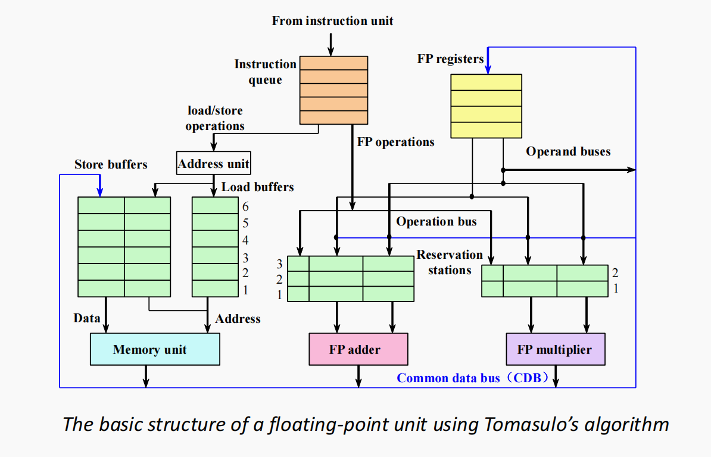
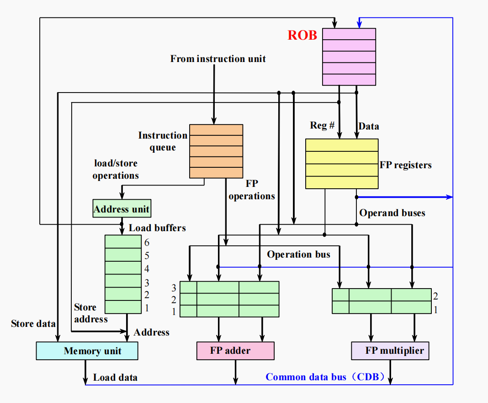

## 动态调度概念

**_Q：为什么需要乱序执行？_**

顺序流水线中，流水线会被慢指令占用，导致后面快指令一直等待。动态调度的核心思想为，能执行的指令先执行，即指令级并行（ILP，Instruction-Level Parallelism）。此时指令流入和流出流水线的顺序可能不同。

乱序执行带来新的data hazard：

- WAR：实际为先读后写（实际可以写到其他寄存器），但乱序后写指令提前到读之前。
- WAW：两条写指令，第二条的目标寄存器为第一条的源寄存器，乱序下先后顺序改变。

寄存器的重命名能在一定程度上解决WAR和WAW。

## Scoreboard算法

Scoreboard算法中，将ID阶段拆成两阶段，整体流水线为IS-RO-EX-WB：

1. IS（issue）：用于发射指令，检查structure hazard。
2. RO（read operands）：用于等待操作数准备好。检查data hazard，如果操作数未准备好则等待。

硬件结构上，新增计分板（scoreboard）和功能部件（functional unit，一个加法、一个除法、两个乘法、一个立即数计算部件）。Scoreboard记录各指令、功能部分的状态，用于调度，包含以下三张表：

1. 指令状态表：对每条指令，记录目前执行到哪里。

| Instruction | IS  | RO  | EX  | WB  |
| ----------- | --- | --- | --- | --- |
| FLD         | √   | √   | √   | √   |
| MUL         | √   |     |     |     |

2. 功能部件状态表：对每个功能部件，记录当前状态，包含：

- Busy：功能部件是否被占用
- Op：操作类型
- Fi：目的寄存器
- Fj/Fk：源寄存器
- Qj/Qk：源操作数由哪个功能部件产生
- Rj/Rk：操作数是否ready

| FU      | Busy | Fi  | Fj  | Fk  | Qj  | Qk  | Rj  | Rk  |
| ------- | ---- | --- | --- | --- | --- | --- | --- | --- |
| Integer |      |     |     |     |     |     |     |     |
| Mult1   |      |     |     |     |     |     |     |     |
| Mult2   |      |     |     |     |     |     |     |     |
| Add     |      |     |     |     |     |     |     |     |
| Divide  |      |     |     |     |     |     |     |     |

3. 结果寄存器表：对每个寄存器，记录哪个功能部件会将结果写入。

| Register | Qi    |
| -------- | ----- |
| F0       | Mult1 |
| F8       | Add   |

**_Q：Scoreboard算法怎么处理RAW？_**

如果操作数未准备完成，则停在RO阶段。

**_Q：Scoreboard算法怎么处理WAR/WAW？_**

如果需要旧值的指令未完成读，则阻止WB。该处等待为scoreboard算法的主要缺点。

**_Q：Scoreboard算法有什么问题？_**

1. 检测到name dependence后等待，而不主动解决（如重命名）
2. 未按照程序原来顺序执行，可能导致非精确异常。

??? examples "例子"

    设不同类型指令的执行时间为：

    - LD 1 cycle
    - ADD 2 cycles
    - MUL 10 cycles
    - DIV 40 cycles

    指令序列为：

    ```
    FLD     F6, 34(R2)
    FLD     F2, 45(R3)
    FMUL.D  F0, F2, F4
    FSUB.D  F8, F6, F2
    FDIV.D  F10, F0, F6
    FADD.D  F6, F8, F2
    ```

    |      | IS  | RO  | EX    | WB  |
    | ---- | --- | --- | ----- | --- |
    | FLD  | 1   | 2   | 3     | 4   |
    | FLD  | 5   | 6   | 7     | 8   |
    | FMUL | 6   | 9   | 10-19 | 20  |
    | FSUB | 7   | 9   | 10-11 | 12  |
    | FDIV | 8   | 21  | 22-61 | 62  |
    | FADD | 13  | 14  | 15-16 | 22  |

    注意点：

    - 示例中没有load buffer，两条load指令需先后执行
    - IS、RO在上一条的WB的下一拍
    - 如果寄存器作为源寄存器的指令未完成RO，则作为目标寄存器的指令不进行WB
    - IS阶段不乱序

## Tomasulo算法

在scoreboard算法基础上引入重命名。进入流水线后，如果数据已准备好，则直接记录实际值，而不是寄存器名称；如果未准备好，则记录将由哪里产生。

指令流出逻辑（从指令队列到保留站/buffer）：保留站/buffer有位置。



硬件结构上，增加：

1. Reservation station：位于功能部件前（图中绿色部分）。所有指令顺序发射后，检查RS是否有容量，有则进入、自动重命名、等待操作数准备好和功能部件空闲。
2. CDB（公共数据总线）：在WB阶段，将指令执行结果广播到所有需要的位置（图中蓝线），实现各寄存器同时得到结果、自动唤醒。

数据表包括指令状态表、保留站状态表、寄存器状态表。

??? examples "例子"

    指令和执行时间同上。

    |      | IS  | EX    | WB  |
    | ---- | --- | ----- | --- |
    | FLD  | 1   | 2-3   | 4   |
    | FLD  | 2   | 3-4   | 5   |
    | FMUL | 3   | 6-15  | 16  |
    | FSUB | 4   | 6-7   | 8   |
    | FDIV | 5   | 17-56 | 57  |
    | FADD | 6   | 9-10  | 11  |

    注意点：

    - IS拍数指读入拍数，不是所有源操作数准备完成的拍数
    - 若寄存器同时作为源寄存器和目标寄存器，源寄存器对应指令IS完成后，目标寄存器对应指令就可以WB

## Hardware-Based Speculation

Tomasulo算法中，指令乱序流出，导致异常难处理、分支预测难恢复等问题。Hardware-based speculation中加入ROB（reorder buffer），在指令执行完后排序等待，保证顺序流出、精确异常。

ROB增加在CDB后。指令进入流水线时，分配ROB编号，记录在reservation station table中；指令执行完后，由CDB写入ROB、而不是直接写寄存器，按编号顺序依次commit时才更新架构寄存器。



??? examples "例子"

    指令和执行时间同上。

    |      | IS  | EX    | WB  | commit |
    | ---- | --- | ----- | --- | ------ |
    | FLD  | 1   | 2-3   | 4   | 5      |
    | FLD  | 2   | 3-4   | 5   | 6      |
    | FMUL | 3   | 6-15  | 16  | 17     |
    | FSUB | 4   | 6-7   | 8   | 18     |
    | FDIV | 5   | 17-56 | 57  | 58     |
    | FADD | 6   | 9-10  | 11  | 59     |
